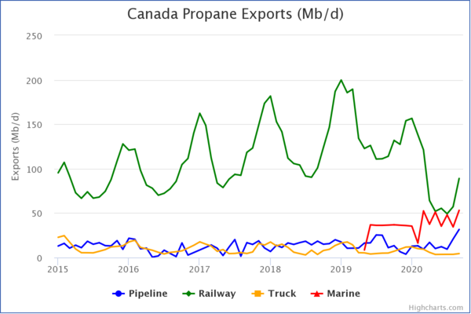
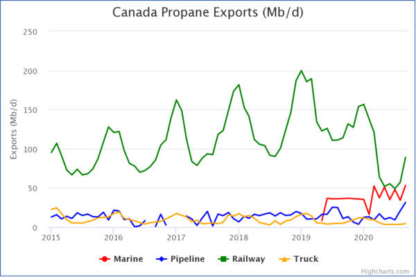
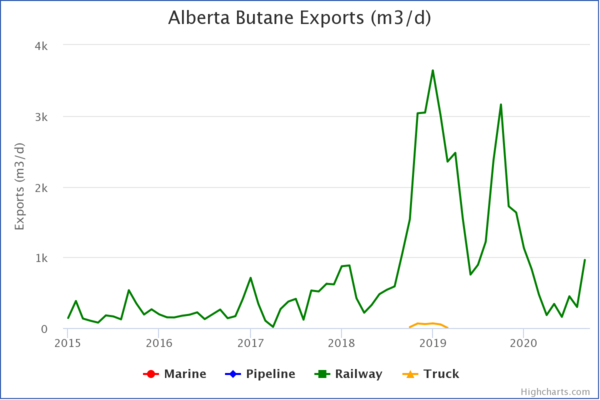

# Highseries [](https://www.npmjs.com/package/highseries)

A data-prep tool for shaping datasets for visualization with Highcharts.

- **NPM:** https://www.npmjs.com/package/highseries
- **Live Example:** https://mbradds.github.io/highseries/
- **Source:** https://github.com/mbradds/highseries

## Installation

```bash
npm i highseries
```

## Introduction

The Highcharts JavaScript api requires that the user data conform to a "series" object, consiting
of at least a series name, and an array of "data" in a JSON style format of {x:value, y:value} pairs for continuous data,
or {name:value, y:value} pairs for categorical data.

Obviously most datasets found online dont conform to this required format. Highseries reads in a users JSON data,
as well as several optional parameters for syling each series, and converts the dataset directly into
an Array of valid series objects that Highcharts can work with.

Highseries aims to be dataset structure agnostic, in that the input data can be tidy, non-tidy,
and contain any kind of column names, stacking, etc.

## Basic usage

```javascript
import Series from "highseries";
import Highcharts from "highcharts";

const data = [
  { Date: "January 1, 2021", valuesCol1: 100, valuesCol2: 200 },
  { Date: "January 2, 2021", valuesCol1: 200, valuesCol2: 100 },
];

let tidySeries = new Series({
  data: data,
  xCol: "Date",
  yCols: ["valuesCol1", "valuesCol2"],
});

//generate the series that will be passed into Highcharts
let forHighcharts = tidySeries.hcSeries;
// Generate the chart
Highcharts.chart("container", {
  // options - see https://api.highcharts.com/highcharts
  series: forHighcharts,
});
```

## Examples

These examples go over using Highseries on a real world dataset of monthly NGL exports from Canada.

- **Data Source:** https://open.canada.ca/data/en/dataset/8cb1d0d0-6ea7-4f6d-b01d-a38fafdcce77

### Tidy data example (one column with numeric data)

| Period     | Product | Origin | Mode of Transportation | Volume (Mb/d) |
| :--------- | :-----: | -----: | ---------------------: | ------------: |
| 2015-01-01 | Butane  | Canada |               Pipeline |          2.57 |
| 2015-01-01 | Propane | Canada |               Pipeline |         12.91 |
| ...        |   ...   |    ... |                    ... |           ... |

```javascript
import Series from "highseries";
import tidyData from "./tidyData.json";

const colors = {
  Marine: "Red",
  Pipeline: "Blue",
  Railway: "Green",
  Truck: "Orange",
};

let tidySeries = new Series({
  data: tidyData,
  xCol: "Period",
  yCols: "Mode of Transportation", //the unique values in this column will have their own series
  valuesCol: "Volume (Mb/d)",
  filters: { Product: "Propane", Origin: "Canada" },
  colors: colors,
});

let forHighcharts = tidySeries.hcSeries;
// Generate the chart
Highcharts.chart("container", {
  // options - see https://api.highcharts.com/highcharts
  series: forHighcharts,
});
```



### Non-tidy data example (multiple columns with numeric data)

| Period     | Product | Origin | Marine | Pipeline | Railway | Truck |
| :--------- | :-----: | -----: | -----: | -------: | ------- | ----- |
| 2015-01-01 | Butane  | Canada |    nan |     2.57 | 15.91   | 0.44  |
| 2015-01-01 | Propane | Canada |    nan |    12.91 | 95.28   | 22.71 |
| ...        |   ...   |    ... |    ... |      ... | ...     | ...   |

```javascript
import Series from "highseries";
import nonTidyData from "./nonTidyData.json";

const colors = {
  Marine: "Red",
  Pipeline: "Blue",
  Railway: "Green",
  Truck: "Orange",
};

let nonTidySeries = new Series({
  data: nonTidyData,
  xCol: "Period",
  yCols: ["Marine", "Pipeline", "Railway", "Truck"], //these columns will have their own series
  filters: { Product: "Propane", Origin: "Canada" },
  colors: colors,
});

let forHighcharts = nonTidySeries.hcSeries;
// Generate the chart
Highcharts.chart("container", {
  // options - see https://api.highcharts.com/highcharts
  series: forHighcharts,
});
```



### Update data/Series options (using non-tidy example)

The update method can be used to modify the data, keeping some of the original options, such as series colors.
This update example converts the chart from Canada Propane exports (Mb/d) to Alberta Butane exports (m3/d).

```javascript
//continuation from previous non-tidy example
nonTidySeries.update({
  data: nonTidyData,
  filters: { Product: "Butane", Origin: "Alberta" },
  transform: { conv: [159, "*"], decimals: 2 }, //multiply values by 159 to convert Mb/d to m3/d
});

forHighcharts = nonTidySeries.hcSeries;
// Generate the chart
Highcharts.chart("container", {
  // options - see https://api.highcharts.com/highcharts
  series: forHighcharts,
});
```


## Notes

Highseries runs on the client. Here are some tips for optimal performance.

- User data should be sorted beforehand. Highseries has a sort() method, but this should be avoided if possible.
- Non-tidy data usually has a smaller file size compared to the same data in tidy format.
- Only include data columns that are critical for the viz.
- Only include data rows that are critical for the viz. Highseries has a filter parameter, which is useful when paired with a HTML dropdown. Only include data "slices" that will be used in the viz.
